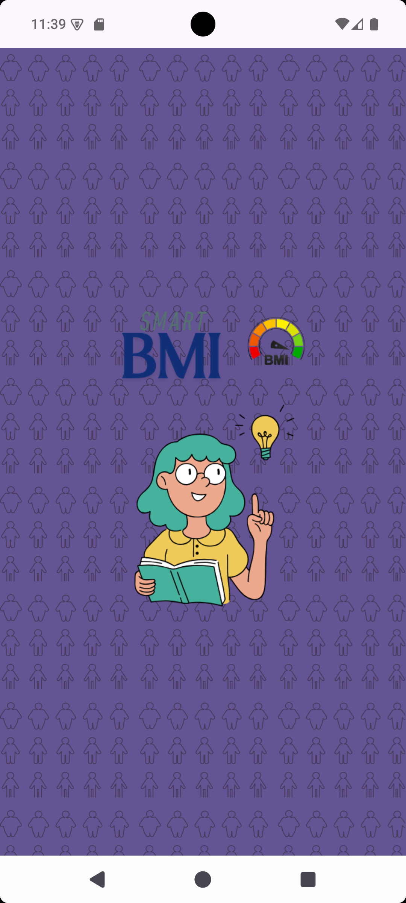
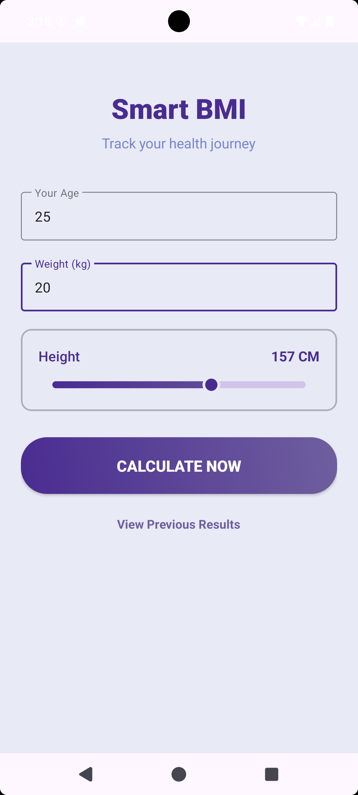
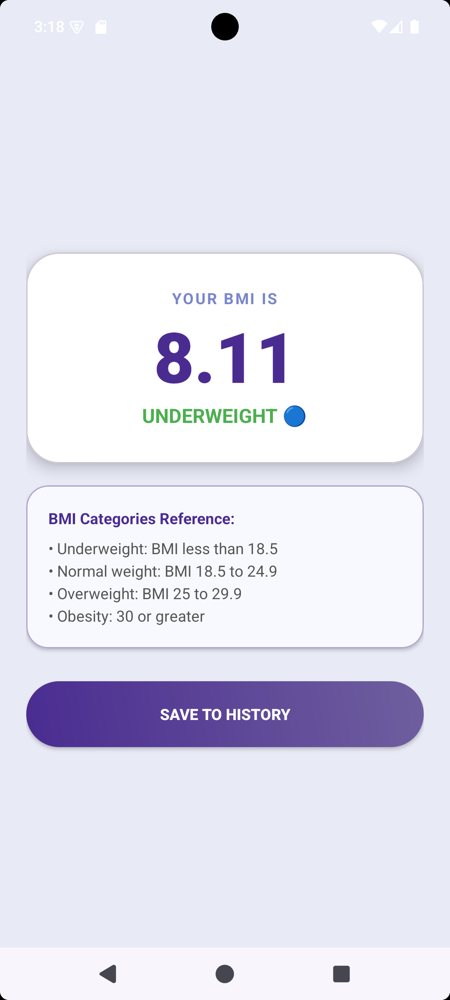
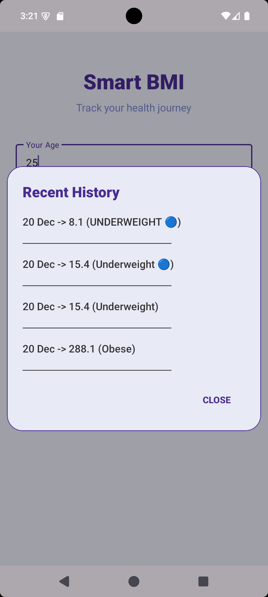

<h1 align="center">⚖️ SMART_BMI</h1>

<h2 align="center">📌 Overview</h2>

  <b>SMART_BMI</b> is a simple Android app that helps users calculate and track their BMI easily. 
  It focuses on a clean interface, smooth usage, and saving recent BMI records.

<h2>✨ Features</h2>

<ul>
  <li><b>🎨 Clean UI:</b> Uses Material Design 3 with a soft lavender theme.</li>
  <li><b>📏 Height Selection:</b> Custom SeekBar for quick and accurate height input.</li>
  <li><b>💾 Auto Fill:</b> Remembers last entered age, weight, and height.</li>
  <li><b>💡 Manual Save:</b> BMI is calculated instantly, but saved only when the user taps <b>Save</b>.</li>
  <li><b>📋 History:</b> Stores the most recent 5 BMI records for easy reference.</li>
</ul>

<h2 align="center">📸 App Preview</h2>

<table align="center">
  <tr>
    <td align="center">
       
      Splash Screen
    </td>
    <td align="center">
       
      Main Screen
    </td>
  </tr>
  <tr>
    <td align="center">
       
      Result Screen
    </td>
    <td align="center">
       
      History
    </td>
  </tr>
</table>

<h2>⚙️ How It Works</h2>

<ol>
  <li><b>User Input:</b> Age, weight, and height are entered using Material input fields.</li>
  <li><b>BMI Calculation:</b> BMI is calculated and shown on the result screen.</li>
  <li><b>Save Logic:</b> When <b>Save</b> is clicked:
    <ul>
      <li>Previous records are loaded from <code>SharedPreferences</code>.</li>
      <li>GSON converts stored data into a list.</li>
      <li>New entry is added at the top.</li>
      <li>If records exceed 5, the oldest entry is removed.</li>
      <li>Updated list is saved again.</li>
    </ul>
  </li>
</ol>

<h2>🛠️ Tech Stack</h2>

<ul>
  <li><b>Language:</b> Java</li>
  <li><b>UI:</b> Material Design 3, CardView, ScrollView</li>
  <li><b>Storage:</b> SharedPreferences</li>
  <li><b>Library:</b> GSON</li>
</ul>

<h2>📥 Installation</h2>

<pre>
1. git clone https://github.com/svidhi08/SMART_BMI.git
2. Add GSON dependency:
   implementation 'com.google.code.gson:gson:2.10.1'
3. Sync the project and run in Android Studio
</pre>

  Developed by <a href="https://github.com/svidhi08">svidhi08</a>

